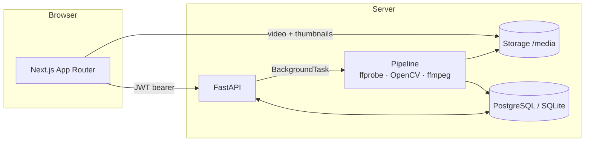

<div align="center">

# RallyLens

### Video review workspace for racket-sport coaches

**Turn a 45-minute training video into a 5-minute coached review.**

Upload match or practice footage → get suggested moments → tag, write feedback, and
share a clean review with your athlete.

[Product](docs/product.md) · [Architecture](docs/architecture.md) · [API](docs/api.md) · [Video pipeline](docs/video-processing.md) · [Design](docs/design.md) · [Monetization](docs/monetization.md) · [Limitations](docs/limitations.md)

`Next.js` · `TypeScript` · `Tailwind` · `FastAPI` · `SQLAlchemy` · `PostgreSQL` · `FFmpeg` · `OpenCV` · `Docker`

</div>

---

## What it is & why it exists

Coaches already record lessons and matches — the painful part is turning that
footage into useful feedback: scrubbing for the moments that matter, clipping and
screenshotting, and sending messy notes across texts and emails.

**RallyLens** turns a raw session into a clean review workspace: motion-based
**suggested moments**, coach-authored tags and notes, private vs. athlete-visible
feedback, and a polished **share link** an athlete actually opens.

It's **coach productivity software** — not officiating, not a generic AI app, and
it makes **no accuracy or ML claims**. Suggested moments come from honest motion
analysis you accept or reject.

**Target customer:** private tennis / pickleball / badminton coaches and small
academies. More in [`docs/product.md`](docs/product.md).

## Demo credentials

```
email:    demo@rallylens.app
password: password123
```
The seeded demo workspace includes a coach, 3 athletes, 5 sessions, processed
synthetic videos, and ~30 review events — every screen is populated immediately.
You can also click **"Open demo workspace"** on the login page.

## Screenshots

> _Add captures to `docs/screenshots/` when publishing._

| Landing | Dashboard | Review workspace | Athlete share page |
|---|---|---|---|
| `docs/screenshots/landing.png` | `docs/screenshots/dashboard.png` | `docs/screenshots/review.png` | `docs/screenshots/share.png` |

## Quick start

### Docker (recommended)
```bash
docker compose up --build
# Frontend  → http://localhost:3000
# API docs  → http://localhost:8000/docs
```
Seeds the demo workspace automatically on first run.

### Local (no Docker — uses SQLite)
```bash
# Backend  (needs FFmpeg on PATH)
cd backend && python -m venv .venv
# Windows: .venv\Scripts\activate  | POSIX: source .venv/bin/activate
pip install -r requirements.txt
python -m app.seed
uvicorn app.main:app --reload --port 8000

# Frontend (new terminal)
cd frontend && npm install && npm run dev
```
Full instructions: [`docs/deployment.md`](docs/deployment.md).

## Architecture



A TypeScript monorepo: **`frontend/`** (Next.js App Router, strict TS, a hand-built
Tailwind component system) talks to a **`backend/`** FastAPI service over a typed
client. Same SQLAlchemy models run on SQLite (local) and Postgres (Docker). Details
in [`docs/architecture.md`](docs/architecture.md).

## Video processing (honest by design)

1. `ffprobe` → duration, resolution, fps, codec.
2. OpenCV frame-differencing → a per-timestamp **motion intensity** series.
3. Adaptive peak selection → **suggested moments** (`timestamp`, `score`, reason
   `"motion peak"`, status `suggested`).
4. `ffmpeg` → a thumbnail per moment.

No ML, no "AI", no accuracy claims — the coach accepts or rejects each suggestion.
Full write-up: [`docs/video-processing.md`](docs/video-processing.md).

## API overview

Auth · Athletes · Sessions · Videos · Review events · Share · Metrics · Settings —
JWT-protected and workspace-scoped, with a public `GET /share/{token}`. Interactive
docs at `/docs`. Reference: [`docs/api.md`](docs/api.md).

## Tests

```bash
cd backend && pytest                       # auth, athletes, sessions, events, share, video pipeline
cd frontend && npm run typecheck && npm run build
```
CI runs both on every push/PR ([`.github/workflows/ci.yml`](.github/workflows/ci.yml)).

## Limitations

A working MVP with deliberate simplifications — billing is display-only, demo
metrics are labelled as such, auth uses a JS-readable cookie, jobs run in-process,
and storage is local disk behind an S3-ready interface. The honest list:
[`docs/limitations.md`](docs/limitations.md).

## Roadmap

- **Billing:** Stripe Checkout + webhooks + enforced plan limits ([`monetization.md`](docs/monetization.md)).
- **Athlete portal:** athletes log in to see all their reviews and tag-trend progress.
- **Branded share pages:** logo/colors/custom domain (Club upsell).
- **Scale:** Celery/RQ worker queue, S3/R2 storage with signed URLs, Alembic migrations.
- **Hardening:** httpOnly cookie + BFF proxy, Playwright E2E suite.

## Résumé bullets

- Built **RallyLens**, a full-stack SaaS MVP (Next.js + FastAPI monorepo) that
  turns long racket-sport videos into shareable coached reviews, with a typed API
  client, JWT auth, and a workspace-scoped data model.
- Implemented an **honest video pipeline** (FFmpeg metadata + OpenCV
  frame-differencing) that surfaces motion-peak "suggested moments" with
  per-moment thumbnails via a background job with a real status lifecycle.
- Designed a **premium, calm UI system** from scratch (Tailwind + Radix, light-first
  tokens) — landing page, populated dashboard, and a keyboard-friendly review
  workspace (video + seekable timeline + notes panel).
- Shipped **Dockerized infra** (Postgres + FastAPI + Next.js standalone),
  **GitHub Actions CI** (pytest + typecheck/build), seed data, and full docs.

## GitHub repo description

> RallyLens — a video-review workspace for racket-sport coaches. Upload footage,
> get motion-based suggested moments, tag and write feedback, and share clean
> athlete reviews. Next.js + FastAPI + FFmpeg/OpenCV, Dockerized.

## LinkedIn project description

> **RallyLens — Video review workspace for racket-sport coaches**
> A full-stack SaaS MVP I designed and built end-to-end. Coaches upload practice or
> match footage; RallyLens reads the video, suggests key moments from motion
> analysis, and gives them a calm workspace to tag moments, write private and
> athlete-visible feedback, and share a polished read-only review link — no login
> for the athlete.
> Built with Next.js (App Router, TypeScript) and a custom Tailwind design system
> on the front end, FastAPI + SQLAlchemy on the back end, and an honest FFmpeg +
> OpenCV pipeline (no "AI accuracy" claims). Shipped with Docker Compose, GitHub
> Actions CI, seed data, and thorough docs.

---

<div align="center">
<sub>A portfolio MVP. Not affiliated with any sports brand. Demo data is synthetic and labelled as such.</sub>
</div>
