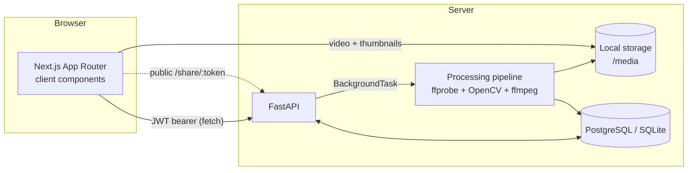
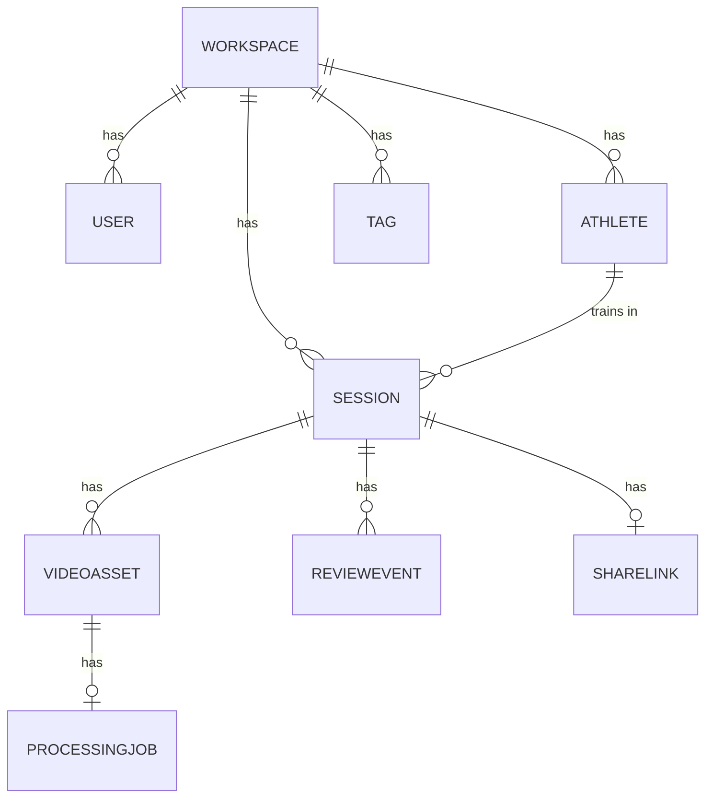

# RallyLens — Architecture

## Monorepo layout
```
rally-lens/
├── frontend/      Next.js (App Router, TS strict) + Tailwind + custom UI system
├── backend/       FastAPI + SQLAlchemy + the video pipeline
├── docs/          product / architecture / api / video / design / etc.
├── scripts/       seed helper
├── demo-assets/   notes on synthetic demo footage
├── .github/       CI workflow
└── docker-compose.yml
```

## Stack
| Layer | Choice |
|---|---|
| Frontend | Next.js 14 (App Router), TypeScript (strict), Tailwind CSS, Radix primitives, Recharts, lucide-react, sonner |
| Backend | FastAPI, SQLAlchemy 2.0, Pydantic v2 |
| Auth | bcrypt password hashing + JWT bearer tokens |
| DB | PostgreSQL (Docker/prod); **SQLite by default** for zero-config local dev & tests |
| Video | `ffprobe` (metadata) + OpenCV (motion peaks) + `ffmpeg` (thumbnails) |
| Storage | Local filesystem behind a small `Storage` interface (S3/R2-ready) |
| Infra | Docker Compose, GitHub Actions |

## System diagram


## Request & auth flow
1. `POST /auth/login` (or `/signup`) returns a **JWT**. Signup also creates a
   `Workspace` and seeds the default tag set.
2. The frontend stores the token in a cookie (`rl_token`) — read by Next
   **middleware** to gate `/dashboard`, `/review`, etc. — and sends it as an
   `Authorization: Bearer` header on every API call.
3. Backend resolves the token to the current `User`; **all queries are
   workspace-scoped** so coaches only ever see their own data.
4. The public `GET /share/{token}` endpoint needs no auth and returns only
   athlete-visible, kept moments.

> **MVP auth trade-off:** the token is in a JS-readable cookie for simplicity.
> Production hardening (httpOnly cookie + a BFF proxy) is noted in
> [`limitations.md`](limitations.md).

## Data model


Models live in [`backend/app/models.py`](../backend/app/models.py):
`Workspace, User, Athlete, Session, VideoAsset, ProcessingJob, Tag, ReviewEvent,
ShareLink`.

### Design decisions on the model
- **`Comment` and `ClipRange` are folded into `ReviewEvent`.** The spec lists them
  as separate objects, but the actual UI uses one private `coach_note`, one
  `athlete_note`, and inline `clip_start_seconds` / `clip_end_seconds` per moment.
  Splitting them into tables would add joins and CRUD with no MVP payoff
  (simplicity-first). They can graduate to their own tables (threaded comments,
  multiple clips per moment) without touching the rest of the schema.
- **String UUID primary keys** keep things portable across SQLite/Postgres and
  double as unguessable share tokens.
- **No circular `Workspace ↔ User` FK** — a `User.is_owner` flag marks the
  founder instead.
- **Enum-like fields are validated strings**, not DB enums, to avoid painful
  cross-database migrations.

## Storage abstraction
`backend/app/storage.py` exposes a tiny `Storage` interface
(`save_upload`, `save_bytes`, `path`, `url`, `delete`, `size`). The MVP ships a
`LocalStorage` implementation that writes under `STORAGE_DIR` and is served at
`/media/...` via Starlette's `StaticFiles` (which supports HTTP range requests, so
the `<video>` player can seek). An S3/R2 implementation only needs to satisfy the
same methods — call sites don't change.

## Background processing
Uploads kick off a `ProcessingJob` via FastAPI `BackgroundTasks`
(`backend/app/processing.py`). The job opens its own DB session, walks the
pipeline, and updates a real status lifecycle (`queued → running → done|error`)
with a `progress` percent that the frontend polls via `GET /videos/{id}/status`.
For higher throughput this would move to a Celery/RQ worker — the job model is
already shaped for it.

## Why SQLite *and* Postgres
One `DATABASE_URL` switches between them and the same SQLAlchemy models run on
both. SQLite means `pip install && seed && pytest` works with **no services**;
Postgres is used in Docker and would be used in production. Migrations are a
documented next step (Alembic) — the MVP uses `Base.metadata.create_all`.
