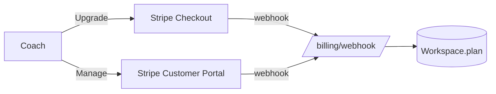

# RallyLens — Monetization

## Pricing
| Plan | Price | For | Levers |
|---|---|---|---|
| **Starter** | $19/mo | Solo coach getting started | up to 3 active athletes |
| **Pro** | $49/mo | Busy private coach | up to 10 active athletes, custom tags, feedback history, priority processing |
| **Club** | $149/mo | Academy / club team | up to 5 coach seats, unlimited athletes, shared workspace, workspace benchmarks |

Pricing is intentionally a **simple monthly ladder**. The research
([`research.md`](research.md)) showed solo coaches buy self-serve in the
$10–50/mo range and churn fast without immediate value, while academies tolerate
$100–300/mo for a tool that standardizes a workflow across coaches.

## Why this monetizes
- **The shared review is inherently viral.** Every athlete who opens a polished
  review link is a prospect — bottom-of-funnel acquisition built into the core
  loop.
- **Narrow, painful, repeated weekly.** Coaches feel the session-review pain
  every week, so the value is obvious fast (low time-to-value = low churn).
- **Honest framing builds trust.** No "AI accuracy" to over-promise and
  disappoint; the coach stays the expert.

## Upgrade levers (what gates a tier)
- **Active athlete count** — Starter → Pro is the natural solo-coach upgrade.
- **Coach seats + shared workspace** — Pro → Club for academies.
- **Workspace-wide benchmarks & repeatable workflows** — the academy value-add.
- Future paid add-ons: priority/faster processing, storage tiers, longer
  retention, branded share pages.

## Stripe integration (designed, not wired)
The MVP keeps a clean seam for billing:
- `Workspace.plan` already exists and is the single source of truth.
- Planned flow: **Stripe Checkout** for subscribe/upgrade → **webhook**
  (`/billing/webhook`) updates `Workspace.plan` and a `subscription_status` →
  **Customer Portal** for self-serve management.
- Plan limits (athlete/seat caps) become enforced server-side at create-time once
  billing is live (today they're display-only — see
  [`limitations.md`](limitations.md)).

## Next 5 monetizable features
1. **Stripe billing + enforced plan limits** — turn the existing plan field into
   real revenue and upgrade prompts.
2. **Branded/custom share pages** (logo, colors, custom domain) — a clear Club
   upsell athletes' parents see.
3. **Faster/priority processing & longer retention tiers** — usage-based add-ons.
4. **Athlete portal & progress over time** — athletes log in to see all their
   reviews and tag-trend progress (engagement + retention).
5. **Team analytics for academies** — coach activity, athlete coverage, and
   review-throughput dashboards (the Club differentiator).
