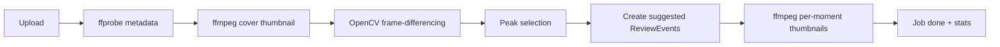

# RallyLens — Video Processing

The pipeline is **deterministic and honest**. It does not run ML, does not claim
accuracy, and does not make officiating calls. It surfaces *motion peaks* as
**suggested moments** — a starting point the coach accepts, rejects, or ignores.

Implementation: [`backend/app/video.py`](../backend/app/video.py) (pure functions)
and [`backend/app/processing.py`](../backend/app/processing.py) (the job
orchestrator).

## Pipeline


### 1. Metadata (`probe_metadata`)
`ffprobe -show_format -show_streams -print_format json` extracts **duration,
width, height, fps, codec, and size**. If `ffprobe` is unavailable or fails, it
falls back to reading the same values via OpenCV.

### 2. Motion intensity (`detect_motion_peaks`)
- Open the video with OpenCV; sample at ~**5 fps** (skip frames with `grab()`,
  decode only the sampled ones).
- Downscale each sampled frame to 160px wide, convert to grayscale, Gaussian-blur.
- Compute the **mean absolute difference** between consecutive sampled frames →
  a per-timestamp motion-intensity series.
- Light 3-tap moving-average smoothing, then normalize to `0..1` by the series max.

### 3. Peak selection
- Adaptive threshold: `max(0.30, mean + 0.4·std)` of the normalized series.
- A point qualifies if it's a **local maximum** in a small window and above the
  threshold.
- Greedily keep the highest-scoring peaks subject to a **minimum 3s gap**, capped
  at **12 moments**, then sort by time.

Each kept peak becomes a suggested `ReviewEvent`:
```
timestamp_seconds, score (0..1 motion intensity), reason="motion peak",
source="suggested", status="suggested", tag=null, thumbnail_key
```

### 4. Thumbnails
`ffmpeg -ss <t> -frames:v 1 -vf scale=…` renders a JPEG for the video cover and
for each suggested moment (OpenCV fallback if `ffmpeg` is missing). Files are
written via the storage adapter and served at `/media/...`.

### 5. Job lifecycle & stats
`ProcessingJob` moves `queued → running → done` with a `progress` percent updated
through the run. On completion it records honest stats:
`suggested_moments`, `processing_seconds`, `duration_seconds`, `moments_per_minute`.
Failures are captured as `status="error"` with the message — the worker never
crashes the request.

## Tuning
| Parameter | Default | Effect |
|---|---|---|
| `sample_fps` | 5.0 | Temporal resolution vs. speed |
| `min_gap_seconds` | 3.0 | Minimum spacing between suggestions |
| `max_moments` | 12 | Cap on suggestions per video |
| threshold | `max(0.30, mean+0.4·std)` | Sensitivity |

## Honesty & limitations
- Motion peaks ≠ "important moments". A ball machine and a rally both create
  motion; the coach is the judge. The UI labels them **"suggested"** with the
  literal reason `motion peak`, never "AI" or "detected".
- Camera shake or panning inflates motion globally; static-camera footage works
  best.
- No object/person/court detection, no scoring, no line calls.

## Synthetic demo footage
With no licensed sports video to ship, the seed script
([`backend/app/seed.py`](../backend/app/seed.py)) generates **clearly-labelled
synthetic clips** with `ffmpeg`: a green court with white lines, a moving ball
marker that drifts and periodically "rallies" (so frame-differencing sees real
peaks), and a `RALLYLENS SYNTHETIC DEMO` + running-timestamp overlay. These are
generated at runtime into gitignored storage — **no video is committed to the
repo**. See [`../demo-assets/README.md`](../demo-assets/README.md).
